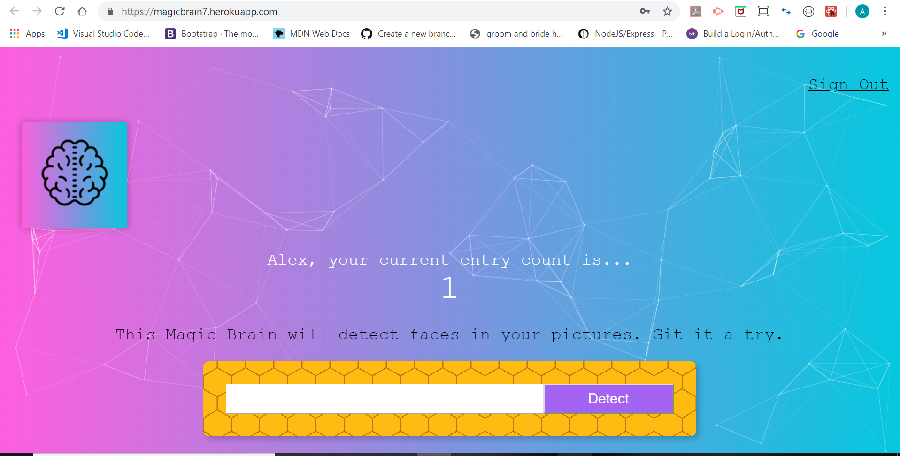

# Project Name
 Smart Brain

## Table of contents
* [General info](#general-info)
* [Screenshots](#screenshots)
* [Technologies](#technologies)
* [See it live](#see it live)
* [Status](#status)
* [Inspiration](#inspiration)
* [Contact](#contact)

## General info

It's a fun app with authentication, you could either sign up or register, then you get access to the detection system. Now all you have to do is grab a face image from any search engine. Copy the image address, and place it on the input in the app and click detect. watch what happens!

## Screenshots

## Technologies
* React - version 16.2.0
* Node JS - version 6.9
* PostgreSQL 
* Heroku
* A number of npm packages 

## See it live!

https://magicbrain7.herokuapp.com

## Status
Project is: Finished

## Inspiration

This is a project from a course titled "the complete web developer course in 2018: from Zero to Mastery. With some changes.

## Contact
Created by [@asldesigns](https://portfolio.aslwebdesign.net/) - feel free to contact me!